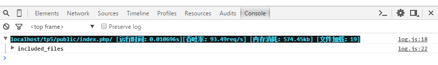
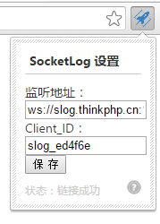

`ThinkPHP`提供了`Socket`日志驱动用于本地和远程调试。

首先需要安装`think-socketlog`扩展
```
composer require topthink/think-socketlog
```

## `Socket`调试

只需要在`log.php`配置文件中设置如下：
~~~
return [
    'type'                => 'SocketLog',
    'host'                => 'slog.thinkphp.cn',
    //日志强制记录到配置的client_id
    'force_client_ids'    => [],
    //限制允许读取日志的client_id
    'allow_client_ids'    => [],
]
~~~

> 上面的host配置地址是官方提供的公用服务端，首先需要去[申请client_id](http://slog.thinkphp.cn) 。

使用Chrome浏览器运行后，打开`审查元素->Console`，可以看到如下所示：


`SocketLog`通过`websocket`将调试日志打印到浏览器的`console`中。你还可以用它来分析开源程序，分析SQL性能，结合taint分析程序漏洞。

### 安装Chrome插件

`SocketLog`首先需要安装`chrome`插件，Chrome[插件安装页面](https://chrome.google.com/webstore/detail/socketlog/apkmbfpihjhongonfcgdagliaglghcod) （需翻墙）

### 使用方法

*   首先，请在chrome浏览器上安装好插件。
*   安装服务端`npm install -g socketlog-server` , 运行命令 `socketlog-server` 即可启动服务。 将会在本地起一个websocket服务 ，监听端口是1229 。
*   如果想服务后台运行： `socketlog-server > /dev/null &` 
   
### 参数

*   `client_id`: 在chrome浏览器中，可以设置插件的`Client_ID` ，**Client_ID**是你任意指定的字符串。 
  
*   设置`client_id`后能实现以下功能：

*   1，配置`allow_client_ids` 配置项，让指定的浏览器才能获得日志，这样就可以把调试代码带上线。 普通用户访问不会触发调试，不会发送日志。 开发人员访问就能看的调试日志， 这样利于找线上bug。 **Client_ID** 建议设置为姓名拼音加上随机字符串，这样如果有员工离职可以将其对应的`client_id`从配置项`allow_client_ids`中移除。 `client_id`除了姓名拼音，加上随机字符串的目的，以防别人根据你公司员工姓名猜测出`client_id`,获取线上的调试日志。

*   设置`allow_client_ids`示例代码：

    ~~~
    'allow_client_ids'=>['thinkphp_zfH5NbLn','luofei_DJq0z80H'],
    ~~~

*   2, 设置`force_client_ids`配置项，让后台脚本也能输出日志到chrome。 网站有可能用了队列，一些业务逻辑通过后台脚本处理， 如果后台脚本需要调试，你也可以将日志打印到浏览器的console中， 当然后台脚本不和浏览器接触，不知道当前触发程序的是哪个浏览器，所以我们需要强制将日志打印到指定`client_id`的浏览器上面。 我们在后台脚本中使用SocketLog时设置`force_client_ids` 配置项指定要强制输出浏览器的`client_id` 即可。
